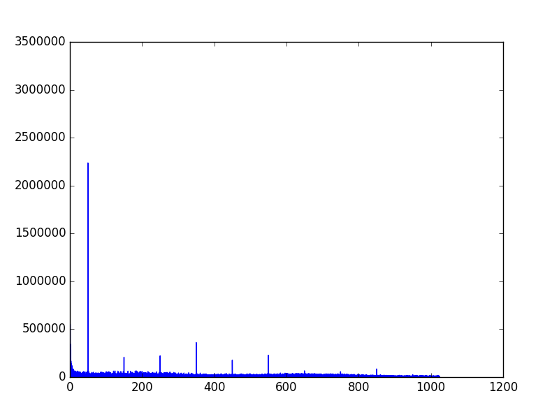
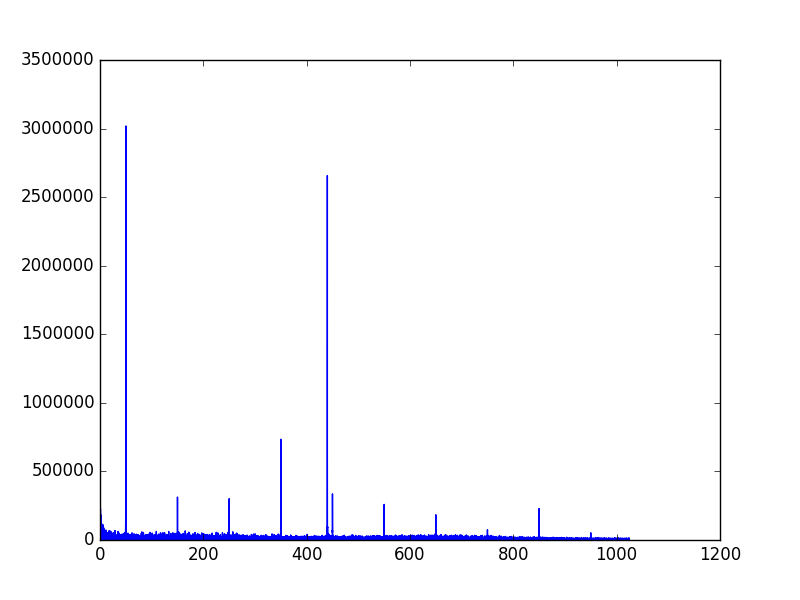

# eeg-fft
Read edf/bdf files and perform discrete fourier transform to identify dominant
frequencies in the signal. The utility consists of an edf/bdf reader edf.py and
a plotting program: plot-signal.py
The plotting program takes currently at least two arguments. The first is the
name of the edf file, and the remaining shall be integer values that is a valid
zero base index in the edf/bdf file.

So for example you can run the program like:
```console
./fft.py sample-data/note440hz.bdf 0 1
```
Then a plot of the channels 1 and 2 is displayed and the result of the fourier
transform is displayed for these channels of this file.

note440hz is a file that is a EEG recording with all electrodes in a little bit
salty water. Simultaneously a 440 Hz note was played via a shielded active studio
monitor. Another file passive-440.bdf is a recording while a stimulus of 440 hz
is played via a unshielded passive speaker. In this case you can see an
additional peak.

# 440 Hz tone with magnetically shielded active monitor
In this picture you can see a clear peak at 50 Hz, which is the mains frequency in
the Netherlands. Additionally you can see some peak at a number of harmonics of
the 50 Hz frequency. 440 hz is not a multiple of 50 so that can't be an harmonic.
At 440Hz there is not realy a component visible.

# 440 Hz tone with passive monitor
In contrast with the shielded active monitor there is a clear peak in the fft at
440 Hz. So this indicates that running an experiment with those passive monitors
you pollute the EEG with the signal that is played at the sound monitors.



# Take home message
When doing EEG, prevent the use of unshielded speakers, for they or the cables
will introduce artifacts in your signal.
